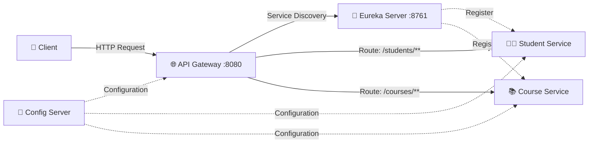

<div align="center">

# 🌐 Student API Gateway

### Intelligent Routing & Service Orchestration for Student Microservices

[](https://spring.io/projects/spring-boot)
[](https://spring.io/projects/spring-cloud)
[](https://openjdk.org/)
[](LICENSE)

[Features](#-features) • [Architecture](#%EF%B8%8F-architecture) • [Quick Start](#-quick-start) • [API Documentation](#-api-routes) • [Configuration](#%EF%B8%8F-configuration)

</div>

---

## 📖 Overview

The **Student API Gateway** serves as the single entry point for the Student Microservices ecosystem. Built with **Spring Cloud Gateway**, it provides intelligent routing, load balancing, and centralized cross-cutting concerns including authentication, rate limiting, and request logging.

### Why API Gateway?

In a distributed microservices architecture, the API Gateway pattern simplifies client-server communication by:

- 🎯 **Unified Access Point** - Single endpoint for all client requests
- ⚖️ **Load Balancing** - Distributes traffic across service instances
- 🔒 **Security** - Centralized authentication and authorization
- 📊 **Monitoring** - Request logging and metrics collection
- 🚦 **Rate Limiting** - Protects services from overload

---

## ✨ Features

<table>
<tr>
<td>

- ✅ **Dynamic Service Discovery**
- ✅ **Client-Side Load Balancing**
- ✅ **Path-Based Routing**
- ✅ **Centralized Configuration**

</td>
<td>

- ✅ **Circuit Breaker Integration**
- ✅ **Request/Response Filtering**
- ✅ **CORS Configuration**
- ✅ **Eureka Integration**

</td>
</tr>
</table>

---

## 🏗️ Architecture



### Service Registry

| Service | Port | Description |
|---------|------|-------------|
| **API Gateway** | `8080` | Main entry point & request router |
| **Eureka Server** | `8761` | Service discovery & registration |
| **Config Server** | `8888` | Centralized configuration management |
| **Student Service** | `808x` | Student management microservice |
| **Course Service** | `809x` | Course management microservice |

---

## 🚀 Quick Start

### Prerequisites

```bash
☑ Java 17 or higher
☑ Maven 3.8+
☑ Running Eureka Server (localhost:8761)
☑ Running Config Server (localhost:8888)
```

### Installation

```bash
# Clone the repository
git clone https://github.com/waseem-sk-dev/student-api-gateway.git
cd student-api-gateway

# Build the project
mvn clean install

# Run the application
mvn spring-boot:run
```

### Docker Deployment

```bash
# Build Docker image
docker build -t student-api-gateway:latest .

# Run container
docker run -p 8080:8080 student-api-gateway:latest
```

---

## 🛣️ API Routes

The gateway routes requests based on path predicates to appropriate microservices:

### Student Service Routes

| Method | Endpoint | Proxied To | Description |
|--------|----------|------------|-------------|
| `GET` | `/students/all` | `student-service` | Retrieve all students |
| `GET` | `/students/{id}` | `student-service` | Get student by ID |
| `POST` | `/students` | `student-service` | Create new student |
| `PUT` | `/students/{id}` | `student-service` | Update student |
| `DELETE` | `/students/{id}` | `student-service` | Delete student |

### Course Service Routes

| Method | Endpoint | Proxied To | Description |
|--------|----------|------------|-------------|
| `GET` | `/courses/all` | `student-course-service` | Retrieve all courses |
| `GET` | `/courses/{id}` | `student-course-service` | Get course by ID |
| `POST` | `/courses` | `student-course-service` | Create new course |
| `PUT` | `/courses/{id}` | `student-course-service` | Update course |
| `DELETE` | `/courses/{id}` | `student-course-service` | Delete course |

### Example Request

```bash
# Get all students
curl http://localhost:8080/students/all

# Get specific course
curl http://localhost:8080/courses/101
```

---

## ⚙️ Configuration

### application.yml

```yaml
# ============================
# Server Configuration
# ============================
server:
  port: 8080

# ============================
# Spring Application
# ============================
spring:
  application:
    name: student-api-gateway

  # ============================
  # Cloud Gateway Routes
  # ============================
  cloud:
    gateway:
      routes:
        # Student Service Route
        - id: student-service
          uri: lb://STUDENT-SERVICE
          predicates:
            - Path=/students/**
          filters:
            - name: CircuitBreaker
              args:
                name: studentServiceCircuitBreaker
                fallbackUri: forward:/fallback/students

        # Course Service Route
        - id: course-service
          uri: lb://STUDENT-COURSE-SERVICE
          predicates:
            - Path=/courses/**
          filters:
            - name: CircuitBreaker
              args:
                name: courseServiceCircuitBreaker
                fallbackUri: forward:/fallback/courses

      # Global CORS Configuration
      globalcors:
        corsConfigurations:
          '[/**]':
            allowedOrigins: "*"
            allowedMethods:
              - GET
              - POST
              - PUT
              - DELETE
            allowedHeaders: "*"

# ============================
# Eureka Client
# ============================
eureka:
  client:
    service-url:
      defaultZone: http://localhost:8761/eureka/
    register-with-eureka: true
    fetch-registry: true
  instance:
    prefer-ip-address: true

# ============================
# Config Server
# ============================
spring:
  config:
    import: optional:configserver:http://localhost:8888

# ============================
# Actuator Endpoints
# ============================
management:
  endpoints:
    web:
      exposure:
        include: health,info,gateway
  endpoint:
    health:
      show-details: always
```

### Environment Variables

```bash
# Override default configuration
export SERVER_PORT=8080
export EUREKA_URI=http://localhost:8761/eureka/
export CONFIG_SERVER_URI=http://localhost:8888
```

---

## 📦 Project Structure

```
student-api-gateway/
├── 📂 src/
│   ├── 📂 main/
│   │   ├── 📂 java/com/student/gateway/
│   │   │   ├── StudentApiGatewayApplication.java
│   │   │   ├── 📂 config/
│   │   │   │   └── GatewayConfig.java
│   │   │   ├── 📂 filter/
│   │   │   │   └── AuthenticationFilter.java
│   │   │   └── 📂 fallback/
│   │   │       └── FallbackController.java
│   │   └── 📂 resources/
│   │       ├── application.yml
│   │       └── bootstrap.yml
│   └── 📂 test/
├── 📄 pom.xml
├── 📄 Dockerfile
├── 📄 .gitignore
└── 📄 README.md
```

---

## 🔧 Development

### Running Tests

```bash
# Run unit tests
mvn test

# Run integration tests
mvn verify

# Generate coverage report
mvn jacoco:report
```

### Debugging

```bash
# Enable debug mode
mvn spring-boot:run -Dspring-boot.run.arguments=--debug

# Remote debugging
mvn spring-boot:run -Dagentlib:jdwp=transport=dt_socket,server=y,suspend=n,address=5005
```

---

## 📊 Monitoring

### Health Check

```bash
curl http://localhost:8080/actuator/health
```

### Gateway Routes

```bash
curl http://localhost:8080/actuator/gateway/routes
```

### Metrics

```bash
curl http://localhost:8080/actuator/metrics
```

---

## 🤝 Contributing

Contributions are welcome! Please follow these steps:

1. 🍴 Fork the repository
2. 🌿 Create a feature branch (`git checkout -b feature/amazing-feature`)
3. 💾 Commit your changes (`git commit -m 'Add amazing feature'`)
4. 📤 Push to the branch (`git push origin feature/amazing-feature`)
5. 🔃 Open a Pull Request

Please ensure your code follows the project's coding standards and includes appropriate tests.

---

## 🐛 Issues & Support

Found a bug or have a feature request? Please [open an issue](https://github.com/waseem-sk-dev/student-api-gateway/issues).

For questions and discussions, join our [Discussions](https://github.com/waseem-sk-dev/student-api-gateway/discussions) forum.

---

## 📝 License

This project is licensed under the **MIT License** - see the [LICENSE](LICENSE) file for details.

---

## 👨‍💻 Author

<div align="center">

### Waseem Shaikh

**Backend Developer** | Java • Spring Boot • Microservices

[](https://github.com/waseem-sk-dev)
[](https://linkedin.com/in/waseem-sk-dev)
[](mailto:waseem@example.com)

</div>

---

## 🌟 Acknowledgments

- Spring Cloud Gateway team for the excellent framework
- Netflix OSS for Eureka
- The open-source community

---

<div align="center">

**⭐ Star this repository if you find it helpful!**

Made with ❤️ by [Waseem Shaikh](https://github.com/waseem-sk-dev)

</div>
